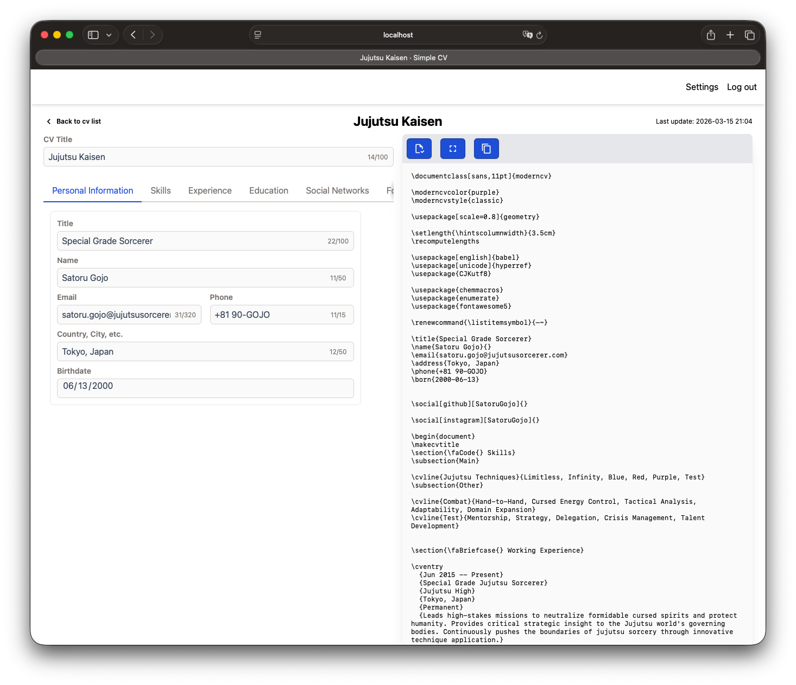
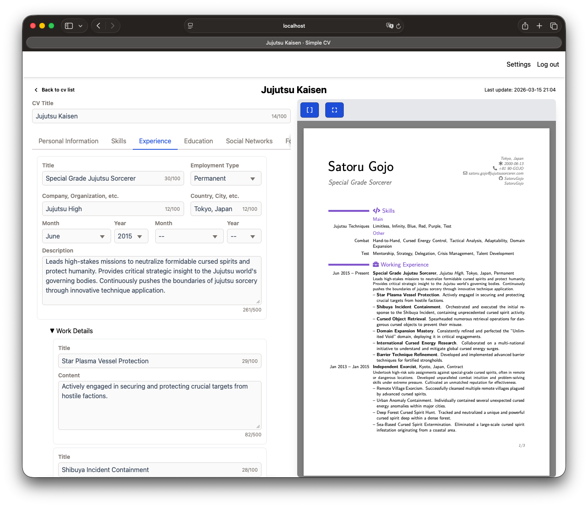

# Modern Resume

Modern Resume is a Phoenix application for building and serving CVs based on the `moderncv` template.

<p align="center">
    
    
</p>

## Run Locally

### 1. Prerequisites

- Erlang `28.4.1`
- Elixir `1.19.5-otp-28`
- Node.js `24.14.0`
- PostgreSQL `16+` (or Docker for the bundled DB service)

### 2. Configure environment variables

Create a local env file from the sample:

```bash
cp .env.sample .env
```

Update at least these values in `.env`:

- `DB_DATABASE`
- `DB_USERNAME`
- `DB_PASSWORD`
- `DB_PORT` (for local Docker DB, use `5432`)
- `SECRET_KEY_BASE` (generate with `mix phx.gen.secret`)

`DATABASE_URL` can stay as-is in `.env.sample` since it is built from the DB variables.

### 3. Start PostgreSQL

Option A (Docker, recommended):

```bash
docker compose -f docker-compose.dev.yml --env-file .env up -d
```

Option B (local PostgreSQL):

- Ensure PostgreSQL is running.
- Ensure your `.env` DB variables point to that instance.

### 4. Install dependencies and set up the app

```bash
source .env
mix setup
```

### 5. Start the server

```bash
source .env
mix phx.server
```

Open http://localhost:4000.
